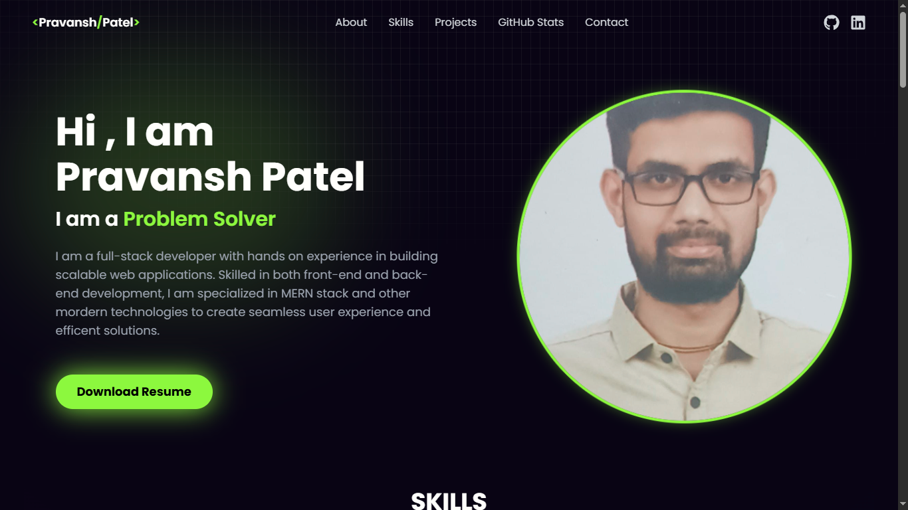
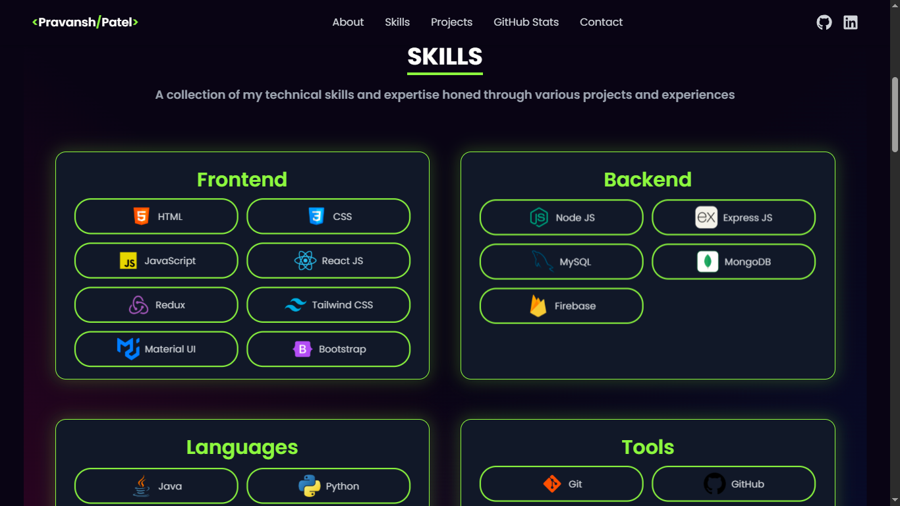
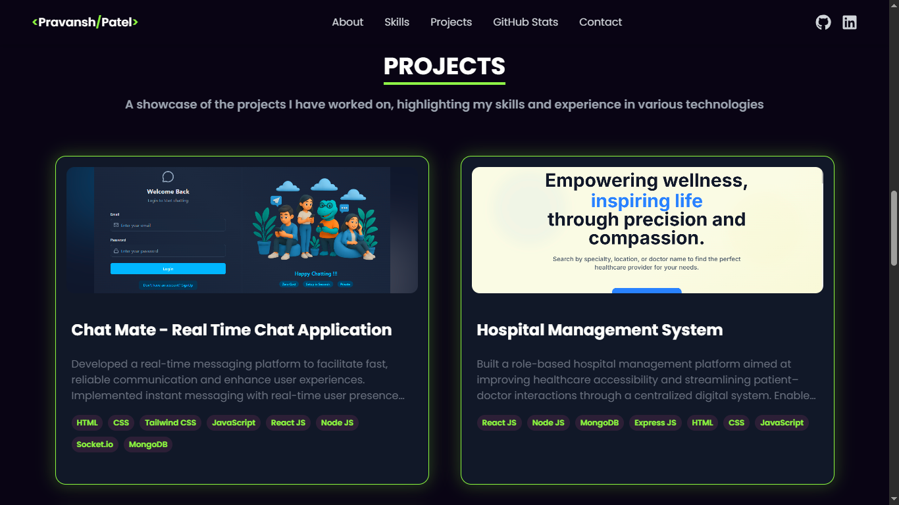

# 👨‍💻 My Portfolio

Welcome to my personal portfolio repository! This project is a modern, responsive web application built to showcase my skills, projects, and professional journey as a developer.

## 🚀 About The Project

This portfolio is designed to be a central hub for my professional identity. It features a clean, interactive user interface that highlights my technical expertise and creative projects.

The application is structured into the following key sections:

- **🏠 Navbar/Hero**: Introduction and navigation.
- **👤 About**: Personal bio and background.
- **🛠️ Skills**: Technical proficiency showcase.
- **💻 Work/Projects**: Gallery of featured projects.
- **🐙 GitHub**: Contributions and coding activity.
- **📫 Contact**: collaborative form for inquiries.

## 📸 Screenshots
About Section

Skills Section

Projects Section

## 📬 Contact

Feel free to reach out directly through the portfolio contact form or connect with me via social links!

---

*Made with ❤️ by Pravansh Patel*
